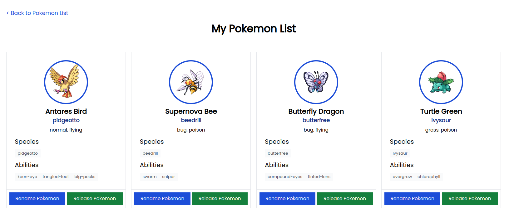
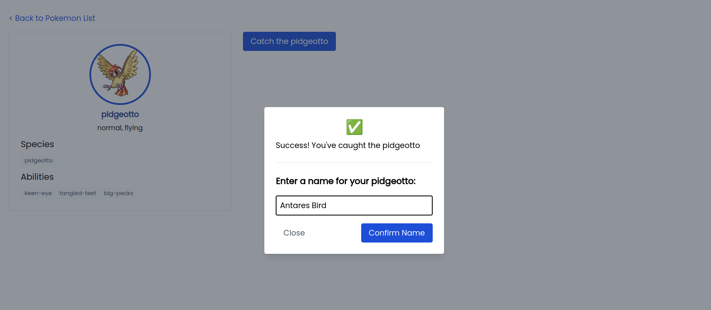
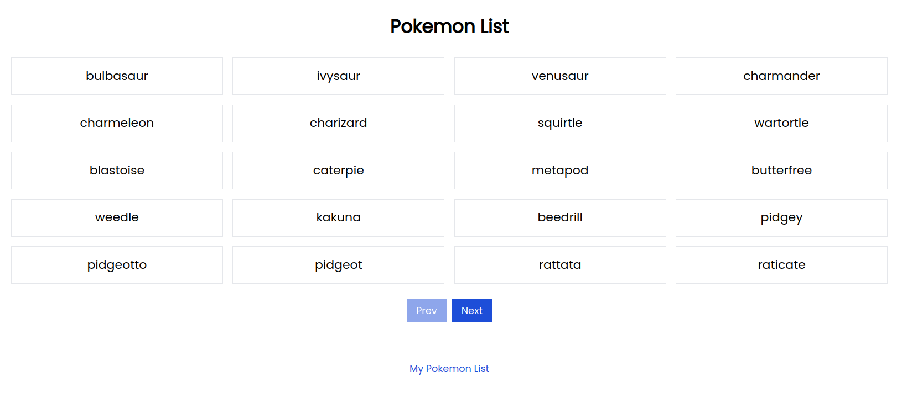

# Pokemon Web

Stacks: Nuxt 3 (frontend) and Express (backend)

## How to build and deploy

You can go to the project frontend or backend, there is Dockerfile inside the project, you can build with docker build command

## Pages

### My Pokemon List

### Catch Pokemon

### Home Pokemon List
